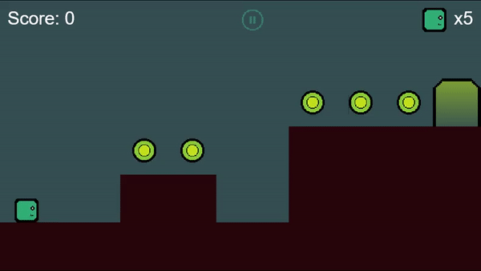

# Flame Simple Platformer

A 2D platformer made using the awesome [Flame engine](https://flame-engine.org/)



## Download/Play

- [Itch.io](https://ufrshubham.itch.io/square-boy)

## Build/Run Steps

```bash
# Clone this project
$ git clone https://github.com/ufrshubham/flame_simple_platformer

# Access
$ cd flame_simple_platformer

# Install dependencies
$ flutter pub get

# Run the project (Make sure that a virtual or physical device is connected first)
$ flutter run

# The will start the game on any connected device.
```

## Browse by timeline

- [Initial Setup](https://github.com/ufrshubham/flame_simple_platformer/tree/9a8916126a691e895c00bd40a16b122b48cbea54)

- [Levels using TiledComponent](https://github.com/ufrshubham/flame_simple_platformer/tree/680df46e70c04370000179d2a3e39f69ee85ad9b)

- [Spawn components using Object layer](https://github.com/ufrshubham/flame_simple_platformer/tree/e2658d9961f306d919dd1855dd1df4f2a5b5d8c8)

- [Collidable platforms](https://github.com/ufrshubham/flame_simple_platformer/tree/c3f1794d939751103061ba19b4990086f74a6f24)

- [Player movement](https://github.com/ufrshubham/flame_simple_platformer/tree/5dd05495e371e3cd88a584d23a8abcdbb6356db4)

- [Camera movement and level bounds](https://github.com/ufrshubham/flame_simple_platformer/tree/ad58f9fd8650e0b0a4095d62595eeff2bf0129de)

- [Version-up Flame 1.1.0](https://github.com/ufrshubham/flame_simple_platformer/tree/80d58fd3e11af5deba9cb4b273af725c58cfcb77)

- [Interactable doors](https://github.com/ufrshubham/flame_simple_platformer/tree/a0230e923b0e0b6186494c234397df445675287c)

- [Version-up Flame 1.1.1](https://github.com/ufrshubham/flame_simple_platformer/tree/cc1b046d103d02187e7b7601fd91715650a36f9d)

- [Coins and effects](https://github.com/ufrshubham/flame_simple_platformer/tree/76d181e7fac6a85e7b2aca65cd9376dfb855a706)

- [Enemy movement and collision](https://github.com/ufrshubham/flame_simple_platformer/tree/08953150b7d086c9b8c7f5d2280653fa2b8f1ba3)

- [Hud, score and health](https://github.com/ufrshubham/flame_simple_platformer/tree/cb91ec6a0f8bd7b6562559f506c5dff13de1e8ae)

- [Version-up Flame 1.2.0](https://github.com/ufrshubham/flame_simple_platformer/tree/50d12ab195a155e25a053e0266c0cfaebace8d53)

- [Attack enemies](https://github.com/ufrshubham/flame_simple_platformer/tree/ce61aa57594aeb1f57d6a0a19c8e6f72efda2136)

- [Adding menus using Overlay](https://github.com/ufrshubham/flame_simple_platformer/tree/cba665f9c11819f7d7af46ea3d88b8a5fb3dff78)

- [Sound effects and background music](https://github.com/ufrshubham/flame_simple_platformer/tree/37b00bab2dab2b38579d6e3571a7d515acd29f17)

## License

This project is under license from MIT. For more details, see the [LICENSE](LICENSE) file.

Some assets provided in this repo are not owned by me. For details about their origin, authors and terms of usage, check their individual licenses.

___

Join my [Discord](https://discord.gg/xHu3aUQGsJ) if you want to discuss something about this project
